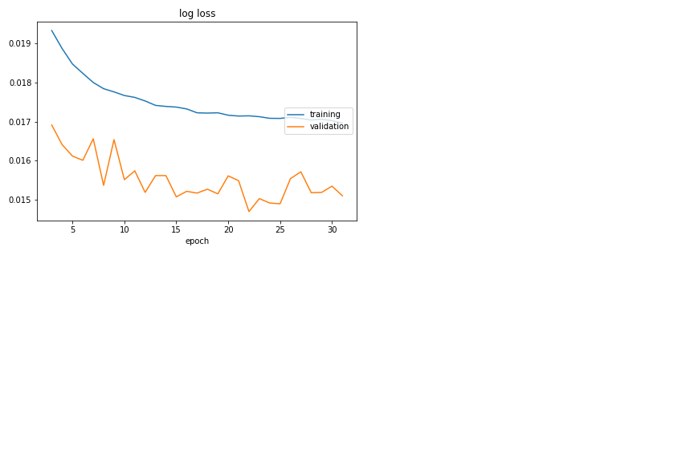
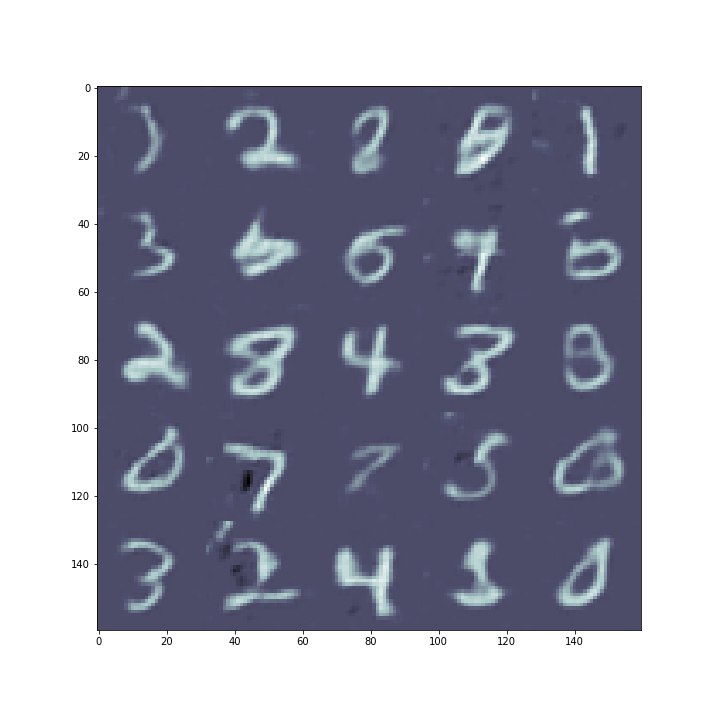
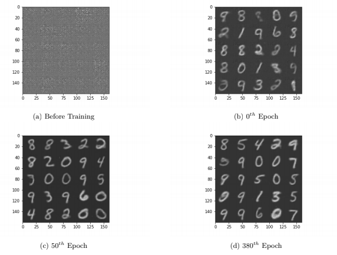
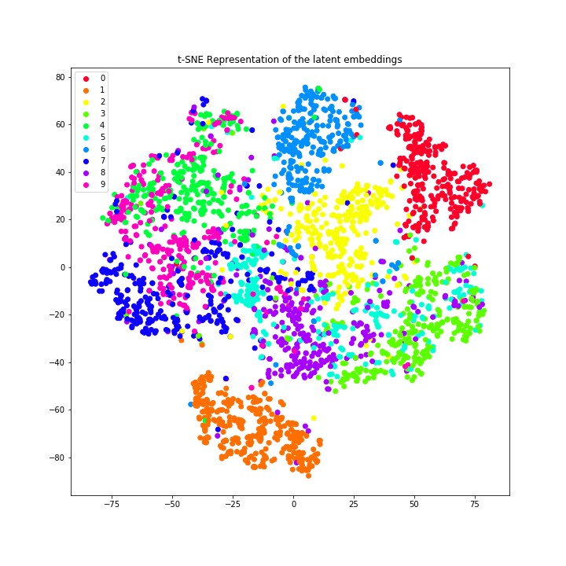
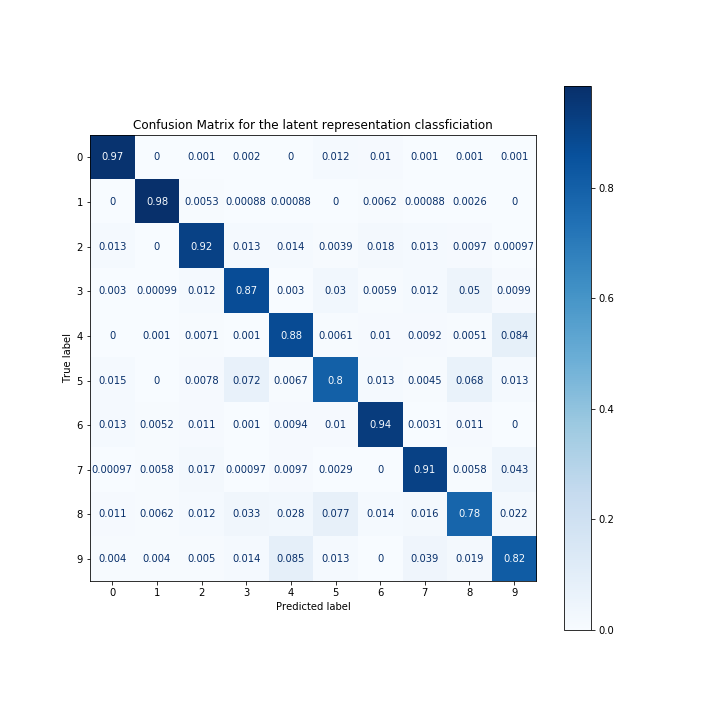

# Vanilla Variational Auto-encoder

This repository contains a PyTorch implementation of training a Vanilla VAE on the __MNIST__ dataset.

For further details on the results and analysis, please refer to the report - ```report.pdf``` 


## Installing Dependencies

Make sure you have a Python3+ version. Run the following command - 

```
pip install -r requirements.txt
```

## Training the Model

There is no need to download the __MNIST__ dataset separately, as the method uses the default __MNIST__ ```Dataloader``` in PyTorch.

The model definition is present in ```code/vae.py``` and the training script is present in ```code/train.ipynb```. Make sure you use a Jupyter Notebook to train, so that the ```livelossplot``` plots can be visualised in real time.

 
## Results

The code for the results are present in ```code/analysis.ipynb``` 

### Loss Plot



### Generated Images

A set of images are randomly sampled from the latent space and plotted as follows - 



### Generation Quality

With the increase in epochs, it is observed that the generation quality of the VAE improves.



### Evaluating the Latent representation

An SVM is trained on the Latent representations of the samples, achieving a test __micro-average F1 score of 0.81__. For further details on the results, please refer to the report - ```report.pdf``` .

#### t-SNE visualisation of the Latent space



#### Classifier Performance




## License 

Copyright (c) 2020 Aditya Chetan and Brihi Joshi

For license information, see [LICENSE](LICENSE) or http://mit-license.org


- - -

Done by [Aditya Chetan](https://github.com/justachetan) and Brihi Joshi


This code was written as a part of a course group assignment in **Deep Learning** with [Dr. Saket Anand](https://www.iiitd.ac.in/anands) at IIIT Delhi during Winter 2020 Semester.

For bugs in the code, please write to: brihi16142 [at] iiitd [dot] ac [dot] in or aditya16217 [at] iiitd [dot] ac [dot] in

